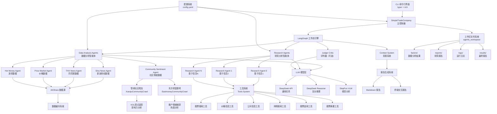
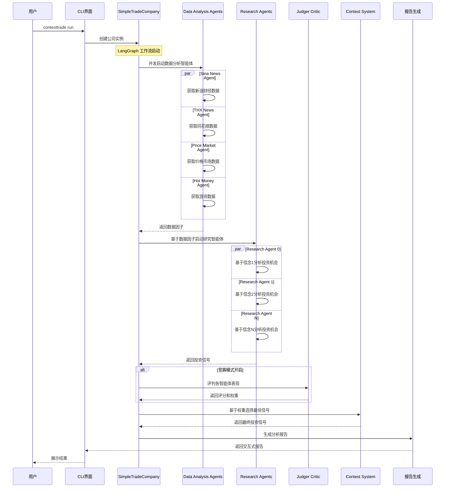
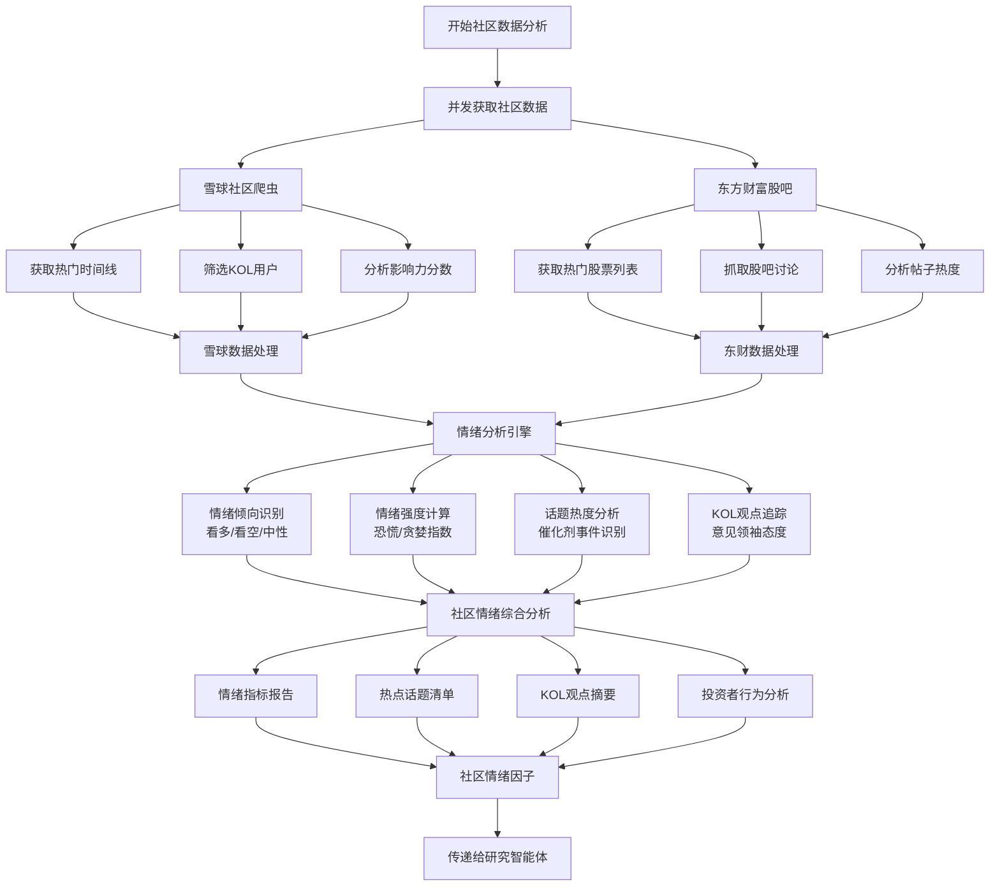

# ContestTrade 项目架构图

## 🏗️ 整体架构概览



## 🔄 数据流程图



## 🏢 核心组件架构

### 1. 主控制层 (Control Layer)
```
SimpleTradeCompany (主控制器)
├── LangGraph 工作流引擎
├── 状态管理 (CompanyState)
├── 事件处理系统
└── 异步并发控制
```

### 2. 智能体层 (Agent Layer)

#### Data Analysis Agents (数据分析智能体)
```
DataAnalysisAgent
├── 数据源管理
│   ├── SinaNewsCrawl (新浪财经)
│   ├── ThxNewsCrawl (同花顺)
│   ├── PriceMarketAkshare (价格数据)
│   └── HotMoneyAkshare (游资数据)
├── 批处理系统
├── LLM 智能过滤
├── 内容深度摘要
└── 多批次合并
```

#### Research Agents (研究分析智能体)
```
ResearchAgent
├── 信念系统 (Belief System)
├── ReACT 推理模式
├── 工具调用系统
│   ├── 股票搜索工具
│   ├── 价格信息工具
│   ├── 公司信息工具
│   ├── 网络搜索工具
│   ├── 股票选择工具
│   └── 股票摘要工具
└── 投资信号生成
```

### 3. 数据层 (Data Layer)
```
数据层架构
├── AKShare 数据接口
├── 多级缓存系统
│   ├── 内存缓存
│   ├── 文件缓存 (.pkl)
│   └── 数据库缓存 (JSON)
├── 市场管理器
│   ├── 股票基础信息
│   ├── 交易日历
│   └── 指数成分股
└── 数据提供者
    ├── Tushare (可选)
    ├── FMP (可选)
    └── Finnhub (可选)
```

### 4. 模型层 (Model Layer)
```
LLM 模型系统
├── 通用 LLM
│   ├── DeepSeek Chat
│   └── 文本生成任务
├── 思考 LLM  
│   ├── DeepSeek Reasoner
│   └── 复杂推理任务
└── 视觉 LLM
    ├── StepFun Vision
    └── 图像分析任务
```

### 5. 工具层 (Tools Layer)
```
工具管理系统
├── 股票符号搜索
├── 股票价格查询
├── 公司基本面信息
├── 网络搜索引擎
├── 股票筛选器
├── 股票摘要生成
└── 最终报告生成
```

### 6. 输出层 (Output Layer)
```
报告生成系统
├── Markdown 报告
├── 终端交互式报告
├── Rich 格式化输出
└── 实时状态显示
```

## 🔧 技术栈

### 核心框架
- **LangGraph**: 工作流编排引擎
- **LangChain**: LLM 应用框架
- **Typer**: CLI 命令行框架
- **Rich**: 终端美化库

### 数据处理
- **AKShare**: 金融数据获取
- **Pandas**: 数据处理
- **Pickle**: 数据缓存

### AI 模型
- **DeepSeek API**: 主要 LLM 服务
- **StepFun API**: 视觉模型服务

### 配置管理
- **YAML**: 配置文件格式
- **Pydantic**: 数据验证

## 📁 目录结构映射

```
contsttrade/
├── cli/                    # CLI 界面层
├── contest_trade/          # 核心业务逻辑
│   ├── agents/            # 智能体实现
│   ├── config/            # 配置管理
│   ├── contest/           # 竞赛系统
│   ├── data_source/       # 数据源管理
│   ├── models/            # 模型层
│   ├── tools/             # 工具系统
│   └── utils/             # 工具函数
├── agents_workspace/       # 工作区
│   ├── factors/           # 数据分析结果
│   ├── reports/           # 研究报告
│   ├── logs/              # 运行日志
│   └── results/           # 最终报告
└── config.yaml            # 主配置文件
```

## 🎭 社区情绪分析流程



## 🎯 特色架构亮点

1. **多智能体并发架构**: 支持多个智能体同时工作，提高分析效率
2. **基于信念的研究系统**: 每个研究智能体基于不同的投资理念进行分析
3. **LangGraph 工作流引擎**: 提供可视化的状态管理和流程控制
4. **多级缓存系统**: 减少 API 调用，提高系统性能
5. **实时交互界面**: Rich 库提供美观的终端界面体验
6. **竞赛机制**: 通过内部竞赛选择最优投资信号
7. **模块化设计**: 高度解耦的组件设计，易于扩展和维护
8. **🆕 社区情绪感知**: 集成雪球、东方财富等社区数据，捕获市场情绪
9. **🆕 KOL观点追踪**: 自动识别和分析有影响力用户的投资观点
10. **🆕 催化剂事件识别**: 从社区讨论中挖掘潜在的市场催化剂

## 🔥 社区数据源特色功能

### 雪球社区爬虫 (XueqiuCommunityCrawl)
- **KOL识别**: 基于粉丝数和互动量筛选高影响力用户
- **情绪分析**: 自动识别看多/看空情绪及强度
- **股票提及**: 智能提取讨论的股票代码
- **影响力评分**: 综合粉丝数、点赞、评论计算影响力

### 东方财富股吧爬虫 (EastmoneyCommunityCrawl)  
- **热门股票追踪**: 自动获取当前热门讨论股票
- **散户情绪**: 捕获普通投资者的真实想法
- **恐慌/贪婪指数**: 量化市场情绪极端程度
- **话题热度分析**: 识别讨论量激增的主题

### 智能情绪分析
- **多层次情绪识别**: 强烈看多/温和看多/中性/温和看空/强烈看空
- **情绪拐点检测**: 识别情绪从极端回归理性的信号
- **反向指标**: 当散户情绪过于一致时提供反向投资参考

这个架构设计体现了现代 AI 应用的最佳实践，将多智能体系统、工作流引擎、传统金融数据和社区情绪数据完美结合，为投资决策提供更全面的信息维度。